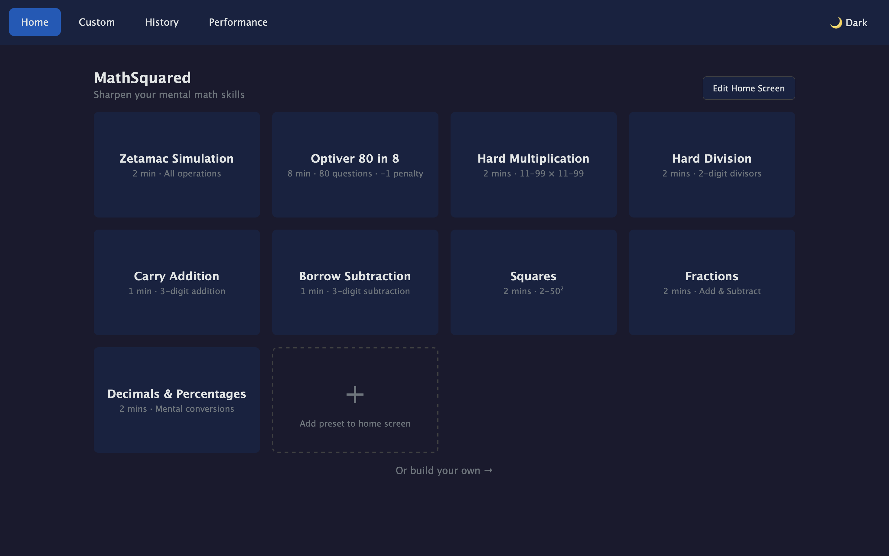
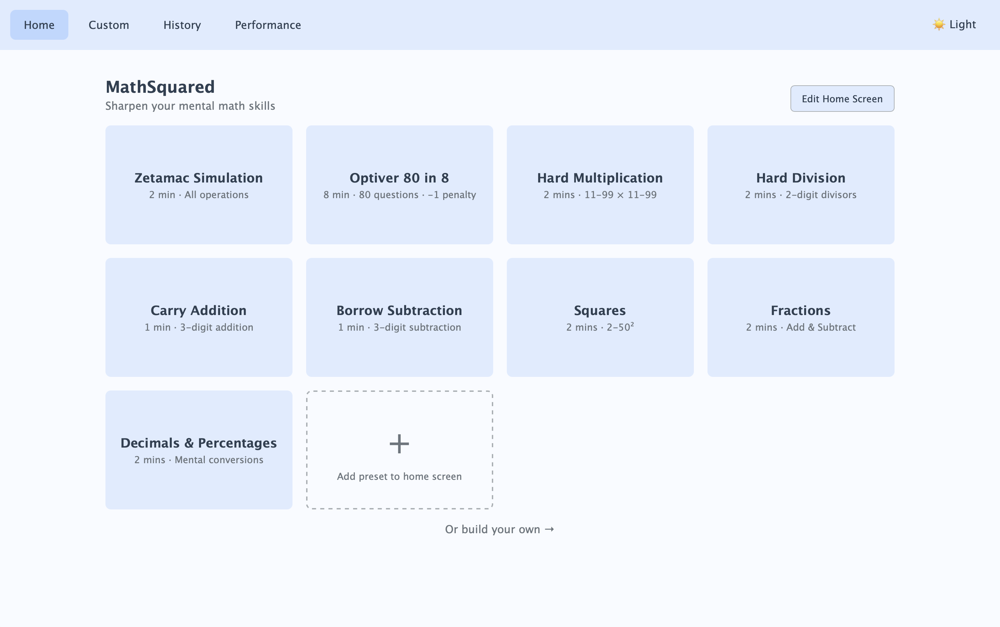

# Math² (MathSquared)

[](https://opensource.org/licenses/MIT)
[](https://developer.mozilla.org/en-US/docs/Web/Progressive_web_apps)

A sleek, highly customizable Progressive Web App (PWA) designed to sharpen your mental math skills. Practice addition, subtraction, multiplication, division, fractions, decimals, and more with real-time analytics and performance tracking.

## Screenshots

<p align="center">
  
</p>
<p align="center">
  <em>Home Screen — Dark Mode</em>
</p>

<p align="center">
  
</p>
<p align="center">
  <em>Home Screen — Light Mode</em>
</p>

## Who Is This For?

This app is designed for anyone looking to improve their mental arithmetic speed and accuracy, particularly those preparing for timed aptitude tests or quantitative assessments commonly used in finance and trading roles.

## Features

### Practice Modes
- **Standard Input** — Type answers with auto-advance
- **MCQ Mode** — Multiple choice for rapid answering
- **Speed Mode** — Per-question countdown timer

### Pre-built Presets

The app includes 14 pre-built presets covering a wide range of mental math skills. By default, a curated selection appears on your home screen, but you can customize your home screen by adding or removing any preset via the "Add" card.

| Preset | Description |
| :--- | :--- |
| **Zetamac Simulation** | 2 min · All operations |
| **Optiver 80 in 8** | 8 min · 80 questions · -1 penalty |
| **Hard Multiplication (2x2)** | 2 min · 11-99 × 11-99 |
| **Hard Division** | 2 min · 2-digit divisors |
| **Fractions** | 2 min · Add & Subtract |
| **Carry Addition** | 1 min · 3-digit addition |
| **Borrow Subtraction** | 1 min · 3-digit subtraction |
| **Squares** | 2 min · 2-50² |
| **Cubes** | 2 min · 2-20³ |
| **Square Roots** | 2 min · Up to 40² |
| **Decimals & Percentages** | 2 min · Mental conversions |
| **Large Addition** | 2 min · 4-digit addition |
| **Multiply & Divide by 11** | 1 min · Speed drills |
| **Multiply & Divide by 12** | 1 min · Speed drills |

Tip: Use the **Custom** tab to build your own sessions, then save them as presets and add them to your home screen.

### Analytics and History
- Real-time stats during practice (score, time, speed)
- Detailed session reports with operation breakdown
- Performance charts showing progress over time
- CSV export for deeper analysis

### Additional Features
- Dark and Light Theme
- Mobile Keypad optimized for touch input
- PWA Support — installable to home screen
- Local Storage — all data stays on your device

## Tech Stack

- **Frontend:** HTML5, CSS3, Vanilla JavaScript (ES6+)
- **Charts:** Chart.js
- **Drag and Drop:** SortableJS
- **Storage:** Browser LocalStorage (No backend required)

## Getting Started

### Option 1: Run Locally

```bash
# Clone the repository
git clone https://github.com/Emilyyy-Ng/math-squared.git

# Navigate to the folder
cd math-squared

# Open index.html in your browser
# For full PWA features, use a local server:
npx serve